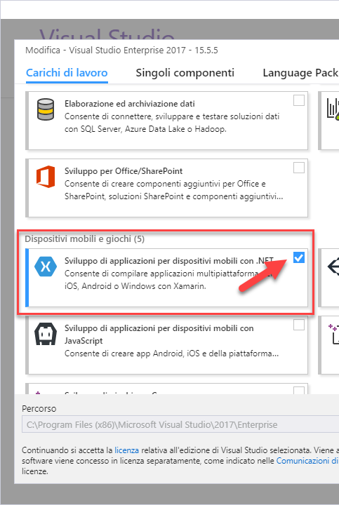
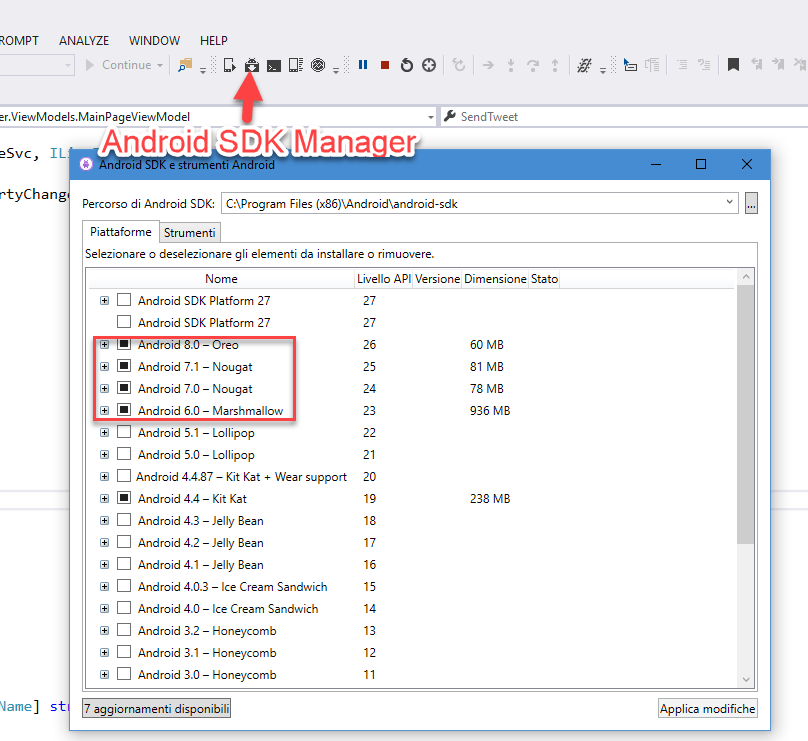

# Introduction

_This is a work in progress README._

This repo contains a simple *Xamarin.Forms* app to access Twitter.
With this app you can read your timeline and post a tweet (text only).

**Xamarin.Forms + Twitter = Xwitter**

# Know issues and limitations

The UWP flavor of the app crashes at the moment of this writing because of this [known bug of Xamarin.Auth](https://github.com/xamarin/Xamarin.Auth/issues/236).

The iOS version of the app is not tested.

If you encouter the followin error or random deployment errors you need to delete bin and obj folder of the project and redeploy. Running Visual Studio 2017 as admin may help.

> Could not locate c:\temp\IC6.Xwitter\IC6.Xwitter\packages.config.  Ensure that this project has Microsoft.Bcl.Build installed and packages.config is located next to the project file. 2 IC6.Xwitter.Android 

# Getting Started
You'll need Visual Studio 2017 (Community Edition is fine) with the Mobile Development Workflow installed.

To build the app you need Android SDK. You can manage Android SDKs with Visual Studio.

# Contribute
Fork the project and do a pull-request.

# Rerences
This app is used as a simple example for the Xamarin.Forms / .NET Standard tutorial on my website [Il Club Delle Sei](https://ilclubdellesei.wordpress.com/2018/02/05/simple-twitter-client-xamarin-forms-net-standard/).

# Project used
* [Xamarin.Auth](https://github.com/xamarin/Xamarin.Auth)
* [Joe Mayo LinqToTwitter](https://github.com/JoeMayo/LinqToTwitter)